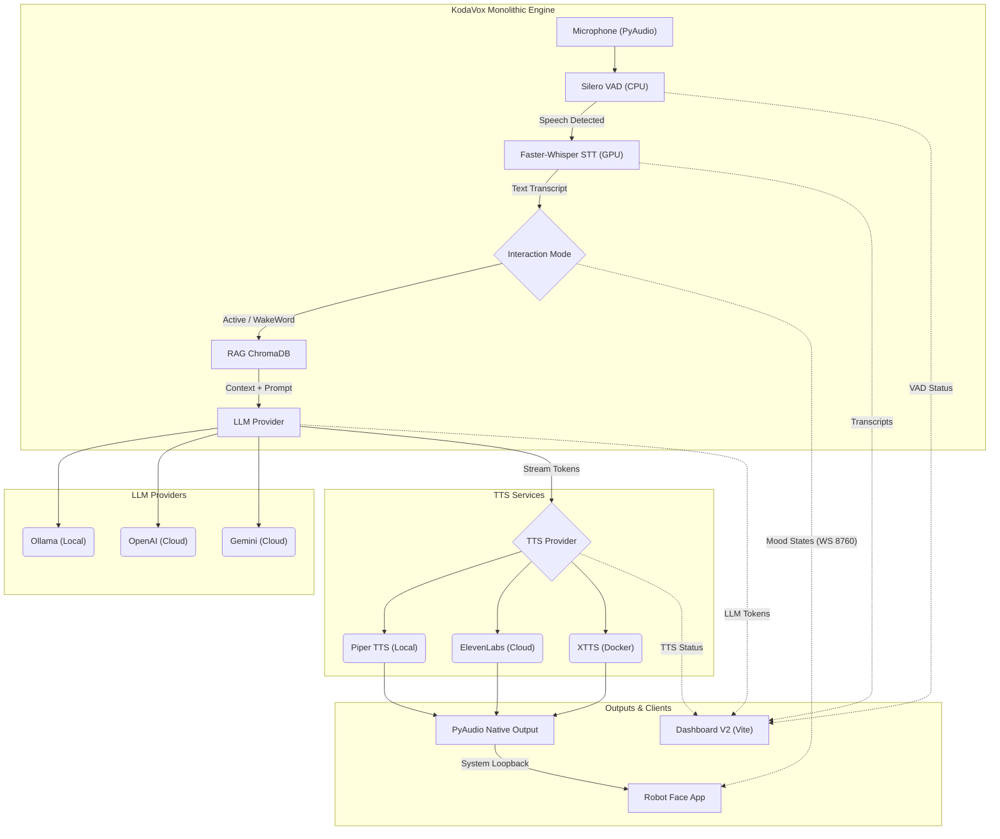

# 🎙️ KodaVox V2: Active Speech Engine

Bienvenido a **KodaVox V2**. Esta versión ha sido rediseñada desde cero para priorizar la **latencia mínima absoluta**, pasando de una arquitectura de microservicios distribuida a un **Motor Monolítico en Memoria** enfocado en una experiencia de "Habla Activa" (Active Speech) fluida.

## 🚀 Nuevas Funciones y Arquitectura (V2.1)
- **Latencia Zero-Internal**: VAD y STT ahora corren en el mismo proceso de Python, eliminando saltos de red.
- **Barge-in Nativo**: El sistema detecta interrupciones de forma instantánea mediante Silero VAD local.
- **RAG y WakeWord nativos**: Se reintegraron en el core monolítico con soporte dinámico.
- **Motor Headless (Socket.IO)**: Telemetría en tiempo real y transmisión de audio crudo por WebSocket.
- **Sincronización con Robot Face**: Integración nativa (vía WS 8760) para controlar animaciones faciales y lip-sync (loopback).
- **Control de Costos**: Módulo integrado para rastrear el consumo de tokens y caracteres en proveedores como OpenAI, Gemini y ElevenLabs.
- **Dashboard de Diagnóstico Extendido**: Nueva interfaz en React/Vite para monitorear telemetría, salud de hardware, costos y estado de la IA en tiempo real.

---

## 🛠️ Requisitos de Instalación (Ubuntu 22.04)

Para que el motor pueda compilar las librerías de audio nativas en Linux, debes instalar las dependencias de desarrollo de PortAudio:

```bash
# 1. Instalar dependencias del sistema (CRUCIAL)
sudo apt-get update && sudo apt-get install -y portaudio19-dev python3-dev build-essential

# 2. Asegúrate de tener Docker y NVIDIA Container Toolkit instalados para el TTS
```

---

## ✅ Validaciones Previas (Checklist)

Antes de ejecutar el sistema, asegúrate de validar los siguientes puntos:

1. **Configuración del Entorno (.env):**
   - Copia el archivo `.env.example` a `.env`: `cp .env.example .env`
   - Configura los proveedores que vayas a usar. Si usas modelos de pago (OpenAI, Gemini, ElevenLabs), asegúrate de colocar tus **API Keys**.
2. **Requisitos de Software:**
   - **Python 3.10+**: Necesario para el motor backend (y el paquete `venv` para entornos virtuales).
   - **Node.js y npm**: Necesarios para poder instalar y ejecutar el Dashboard V2.
3. **Modelos Locales (Ollama):** *(Solo requerido si se usa un modelo LLM local)*
   - Si en tu `.env` tienes configurado `LLM_PROVIDER=ollama`, verifica que el servicio de Ollama esté ejecutándose (`http://127.0.0.1:11434`).
   - Asegúrate de haber descargado el modelo definido en `OLLAMA_MODEL` ejecutando: `ollama pull qwen2.5:1.5b` (o el modelo que hayas elegido).
4. **Dependencias de TTS (Docker):**
   - Si vas a utilizar `TTS_PROVIDER=xtts`, el sistema requiere **Docker** y el plugin **Docker Compose**. *(El script `start_v2.sh` validará su existencia y los instalará automáticamente si no se encuentran en sistemas compatibles con apt).*
   - *(Opcional)* Si usas Piper localmente (`TTS_PROVIDER=piper`), el script `start_v2.sh` descargará automáticamente los modelos requeridos la primera vez si no existen.

---

## ⚡ Ejecución del Sistema

Puedes iniciar KodaVox V2 de dos formas: en primer plano (ideal para pruebas y desarrollo) o en segundo plano usando PM2 (recomendado para producción).

### Opción A: Ejecución Manual (Primer Plano)

Levanta todo el entorno (Docker, Venv, Motor y Dashboard) con un solo comando. Verás los logs directamente en tu consola.

```bash
# Otorga permisos de ejecución si es la primera vez
chmod +x start_v2.sh

# Ejecuta el script
./start_v2.sh
```

### Opción B: Ejecución en Producción con PM2 (Segundo Plano)

Para mantener KodaVox corriendo de forma ininterrumpida, gestionar sus logs y reiniciarlo si hay fallos, usaremos **PM2**.

1. **Instalar PM2 globalmente** (si no lo tienes):
   ```bash
   sudo npm install -g pm2
   ```
2. **Iniciar el sistema** utilizando el archivo `ecosystem.json` incluido:
   ```bash
   pm2 start ecosystem.json
   ```
3. **Comandos útiles de PM2**:
   - Ver el estado del sistema: `pm2 status`
   - Ver los logs en tiempo real: `pm2 logs kodavox-v2`
   - Detener el sistema: `pm2 stop kodavox-v2`
   - Hacer que el sistema inicie automáticamente al reiniciar el servidor:
     ```bash
     pm2 startup
     pm2 save
     ```

### ¿Qué hace `start_v2.sh` por debajo?
1. Valida e instala Docker si es necesario, y levanta el contenedor de **XTTS** (si aplica).
2. Crea y configura un entorno virtual de Python (`venv`) en la carpeta `orchestrator/`.
3. Instala los requerimientos de Python.
4. Inicia el **Motor Monolítico** (`core_engine.py`) en el puerto 5000.
5. Inicia el **Dashboard V2** en el puerto 5173.

---

## 📊 Interfaz de Usuario y Configuración (Dashboard V2)

Una vez iniciado el sistema, abre tu navegador en:
👉 **http://localhost:5173** (o el puerto consecutivo si está ocupado)

El Dashboard consta de un menú lateral que te permite monitorizar el estado en tiempo real y configurar el comportamiento del agente "al vuelo", sin necesidad de reiniciar el servidor. Aquí tienes una guía de uso para cada sección:

### 1. Monitoreo (Home)
Esta es la pantalla principal para observar qué está "pensando" el motor.
- **Voice Activity (VAD)**: Muestra una barra de energía en tiempo real. Si el indicador cambia a verde ("Usuario Hablando..."), el sistema te está escuchando.
- **Transcripción (STT)**: Lee exactamente lo que el modelo Whisper entendió de tu voz. Útil para verificar si la sensibilidad del micrófono o el ruido de fondo están afectando el reconocimiento.
- **Respuesta LLM**: El flujo de texto palabra por palabra generado por Ollama, OpenAI o Gemini.
- **Síntesis (TTS)**: Indica si el agente está hablando o en silencio.

### 2. Personalidad
Define cómo razona y responde KodaVox mediante un **System Prompt**.
- **Ejemplo de llenado:** `"Eres KodaVox, un asistente técnico muy inteligente pero sarcástico. Siempre respondes en menos de 2 oraciones."`
- *Nota:* Al presionar "Guardar Personalidad", el nuevo comportamiento se aplicará instantáneamente en tu siguiente interacción verbal.

### 3. Wakeword (Palabra Mágica)
Si el `INTERACTION_MODE` en tu `.env` está configurado como `wakeword`, aquí defines cómo despertar al asistente.
- **Palabra de Activación**: El nombre al cual responde. Ejemplo: `Computadora` o `Jarvis`.
- **Temporizador de Sesión**: Los segundos que permanecerá atento a comandos subsecuentes sin necesidad de repetir su nombre (Ej. `10` segundos).

### 4. Voz (Catálogo y Clonación ElevenLabs)
Si usas `TTS_PROVIDER=elevenlabs`, aquí puedes registrar nuevas voces, personalizar su estilo y alternar entre ellas de forma dinámica.

- **Seleccionar Voz**: Usa el menú desplegable superior para cambiar la voz activa al instante.
- **Personalización de Emoción y Estilo**:
  - **Estabilidad**: Define qué tan variable y emotiva (0.0) o qué tan fija y monótona (1.0) suena la voz.
  - **Similitud**: Qué tan apegada es la lectura a la voz clonada original.
  - **Exageración de Estilo**: Amplifica el estilo y las emociones deducidas del texto.
- **Añadir Nueva Voz (Por ID)**: Coloca un "Nombre Descriptivo" (Ej. `Drew (Narrador)`) y pega el "ID de ElevenLabs" (una cadena alfanumérica).
- **Añadir Nueva Voz (Clonar)**: Crea voces en vivo subiendo un archivo `.mp3` / `.wav` o grabando directamente con tu micrófono desde el navegador.

> [!WARNING]
> **Limitación de Clonación:** La creación de nuevas voces (Clonación) requiere de una suscripción de pago en ElevenLabs (Plan *Starter* o superior). Si estás en el plan **gratuito (Free Tier)**, recibirás un error `401 Unauthorized` al intentar clonar. Si es tu caso, usa la pestaña "Por ID" para agregar las voces pre-hechas listadas abajo.

**Voces Populares de ElevenLabs (Ejemplos para añadir "Por ID"):**
- **Rachel** (Femenina, Americana, Narración): `21m00Tcm4TlvDq8ikWAM` *(Voz por defecto)*
- **Drew** (Masculino, Americano, Noticias): `29vD33N1CtxCmqQRPOHJ`
- **Antoni** (Masculino, Americano, Calmado): `ErXwobaYiN019PkySvjV`
- **Domi** (Femenina, Americana, Emocional): `AZnzlk1XvdvUeBnXmlld`
- **Elli** (Femenina, Americana, Infantil/Emocional): `MF3mGyEYCl7XYWbV9V6O`
- **Fin** (Masculino, Irlandés, Profundo): `D38z5RcWu1voky8WS1ja`

### 5. Base de Conocimientos (RAG)
Permite inyectar información contextual a largo plazo para que el LLM responda con datos específicos de tu organización.
- **Paso 1 (Crear Colección)**: En el panel izquierdo, escribe un nombre (ej. `manual_empleados`) y da clic en "Crear".
- **Paso 2 (Subir Documento)**: En el panel derecho, asegúrate de que la colección de destino esté seleccionada, elige un archivo de tu computadora (soportados: `.txt, .md, .pdf, .json, .csv`) y presiona "Subir e Indexar Documento".
- **Paso 3 (Activar)**: En la esquina superior derecha, bajo la caja "Cerebro Activo", selecciona la colección que quieres que el agente lea.
- *Ejemplo de interacción:* Sube un PDF del manual de tu empresa y luego pregúntale a KodaVox por el micrófono: *"¿Cuáles son las políticas de vacaciones según el manual?"*.

### 6. Diagnósticos y Proveedores
- **Diagnósticos**: Muestra semáforos (OK/Falla) para los módulos internos de hardware (VAD, Whisper, Base de Datos). Aquí también puedes usar los *Toggles* (interruptores) para apagar la salida física de audio, o bien, encender la **Sincronización de Estados con Robot Face**.
- **Proveedores**: Define tus costos por "Millón de tokens/caracteres" para monitorear cuánto dinero real has consumido en el día usando las APIs en la nube.

---

## 👥 Notas de Desarrollo
- El motor se comunica con **Ollama** en `http://127.0.0.1:11434`. Asegúrate de tener Ollama corriendo localmente con el modelo configurado (por defecto `qwen2.5:3b`).
- La configuración principal reside en el archivo `.env` en la raíz.
- **Descargas la Primera Vez:** Cuando cambies la variable `STT_MODEL` (ej. a `tiny` o `medium`), el sistema descargará el modelo de Internet la primera vez que se ejecute. Esto puede tomar varios minutos sin mostrar una barra de progreso; no cierres el programa.
- La voz de XTTS se conserva en la configuración persistente del servicio, para reutilizar sus latentes. Para forzar otra voz al iniciar, define `TTS_CONFIGURE_VOICE_ON_START=true` y `VOICE_SAMPLE=<archivo.wav>` en `.env`.
- Puedes seleccionar `TTS_PROVIDER=xtts`, `TTS_PROVIDER=piper` u `off`. Piper usa por defecto `models/es_MX-claude-high.onnx`, no requiere GPU ni clonación y admite ajustar la velocidad con `PIPER_LENGTH_SCALE`.
- La precisión de STT se controla con `STT_MODEL` (`small` o `medium`), `STT_INITIAL_PROMPT`, `STT_VAD_FILTER` y `STT_CONDITION_ON_PREVIOUS_TEXT`. `medium` requiere más VRAM y suele aportar mejor precisión en español.
- `INTERACTION_MODE=active` responde a cada intervención detectada por VAD. `INTERACTION_MODE=wakeword` exige que la transcripción contenga `WAKE_WORD` (por defecto `KodaVox`); puedes decir “KodaVox, ¿qué hora es?” o decir primero “KodaVox” y hacer la consulta en el siguiente turno. Tras responder, la sesión permanece abierta durante `WAKE_SESSION_TIMEOUT_SECONDS` (10 por defecto); después vuelve a requerir la frase de activación. `VAD_THRESHOLD`, `VAD_END_SILENCE_SECONDS` y `STT_MIN_SPEECH_SECONDS` controlan la sensibilidad.

---

## 🤖 Integración con Robot Face (Avatar)
KodaVox V2 incluye soporte nativo para el proyecto **Robot Face (OctopID)**. KodaVox actúa como el "cerebro" y controla directamente las expresiones y el lip-sync de la cara.

Para usarlo:
1. Inicia tu backend original de Robot Face (`audioServer.py` y `app_fastapi.py`).
2. Abre tu interfaz `face.html`.
3. En el Dashboard V2 de KodaVox, ve a la pestaña **Diagnósticos**.
4. Activa la opción **Sincronización de Estados (Robot Face)**.
*La sincronización labial (Lip-Sync) funcionará de forma automática ya que tu `audioServer.py` escucha la salida nativa de KodaVox mediante loopback de sistema.*

## 💰 Sistema de Costos
El motor guarda diariamente los consumos en `orchestrator/data/usage_stats.json`. En la pestaña de **Proveedores** del Dashboard puedes configurar cuánto pagas por Millón de tokens/caracteres, y KodaVox calculará tu gasto del día en tiempo real.

---

## 🏗️ Arquitectura y Diseño

KodaVox V2 está diseñado alrededor de un **Motor Monolítico en Memoria** para reducir la latencia al mínimo absoluto. Al procesar el audio directamente en memoria y utilizar sockets bidireccionales, el sistema logra respuestas casi instantáneas (zero-internal latency) comparado con soluciones basadas en microservicios y REST APIs.

### Diagrama de Flujo del Sistema



### Componentes Principales

1. **VAD (Voice Activity Detection)**: Utiliza **Silero VAD** corriendo en la CPU. Evalúa ventanas de audio muy pequeñas (~32ms) para detectar con precisión cuándo el usuario empieza a hablar (Barge-in) y cuándo termina.
2. **STT (Speech-to-Text)**: Implementado con **Faster-Whisper**. En hardware compatible (NVIDIA), corre en la GPU usando cuantización `int8_float16` para máxima velocidad. **Si no cuentas con GPU**, el sistema lo detectará automáticamente y ejecutará el modelo en la CPU utilizando cuantización `int8`, lo que permite un rendimiento aceptable en procesadores modernos sin necesidad de configuración adicional.
3. **Manejador de Contexto (RAG)**: Integrado nativamente con **ChromaDB**. Antes de consultar al LLM, el texto es inyectado con contexto relevante extraído de los documentos cargados.
4. **Proveedores LLM**: Arquitectura agnóstica mediante un patrón de fábrica (`LLMFactory`). Soporta Ollama para despliegues 100% privados y locales, o OpenAI/Gemini para mayor capacidad de razonamiento.
5. **Proveedores TTS**: 
   - **Piper**: Síntesis neuronal extremadamente rápida y ligera.
   - **XTTS**: Clonación de voz avanzada alojada en Docker.
   - **ElevenLabs**: TTS en la nube de máxima expresividad mediante WebSockets.
6. **Telemetría en Tiempo Real**: Todo el estado interno (niveles de micro, detección de voz, streaming de tokens) se emite vía **Socket.IO** hacia el Dashboard V2, permitiendo un monitoreo exhaustivo sin afectar el ciclo de procesamiento de audio.

---

## ⚠️ Solución de Problemas (Troubleshooting)

Al desplegar el sistema en un entorno completamente nuevo, podrías encontrarte con los siguientes casos límite:

1. **Falla al instalar PyAudio (Librerías C ausentes)**
   - Si durante la instalación de dependencias ves un error rojo extenso relacionado con `portaudio.h`, significa que te saltaste la instalación de dependencias del sistema.
   - **Solución:** Ejecuta `sudo apt-get install portaudio19-dev python3-dev build-essential`.
2. **Paquete `venv` de Python no instalado**
   - En algunas distribuciones (como Ubuntu), Python 3 viene preinstalado, pero la librería para crear entornos aislados no. El script fallará al ejecutar `python3 -m venv venv`.
   - **Solución:** Ejecuta `sudo apt-get install python3-venv`.
3. **Falta de Node.js o npm**
   - El script `start_v2.sh` requiere estrictamente `npm` para levantar el Dashboard, ya que es a través de este que se configura el agente (RAG, cambio de voces, etc). Si no lo tienes, el script se abortará intencionalmente.
   - **Solución:** Instala Node.js y npm (`sudo apt-get install nodejs npm` o usa NVM).
4. **El Puerto del Backend está ocupado**
   - Si otro servicio está usando el puerto configurado (por defecto `5000`), el motor colapsará indicando `Address already in use`. A diferencia de Vite, el motor no cambia de puerto automáticamente.
   - **Solución:** Modifica la variable `ENGINE_PORT` en tu archivo `.env` por otro puerto libre (ej. `5001`).
5. **Instalación de Docker rechazada**
   - Si usas `TTS_PROVIDER=xtts` y no tienes Docker, el script intentará instalarlo vía `apt`. Si usas macOS, Fedora, o CentOS, la instalación fallará.
   - **Solución:** Instala Docker Desktop o Docker Engine manualmente para tu sistema operativo.
6. **Falta de Memoria RAM (Proceso "Killed")**
   - Si el sistema corre en un servidor con menos de 4GB de RAM y sin archivo Swap, el sistema operativo invocará al *OOM Killer* al cargar los modelos de lenguaje o STT en memoria, cerrando el proceso de Python repentinamente sin lanzar errores explícitos.
   - **Solución:** Añade un archivo de paginación (Swap) de 8GB o incrementa la RAM física del servidor.
