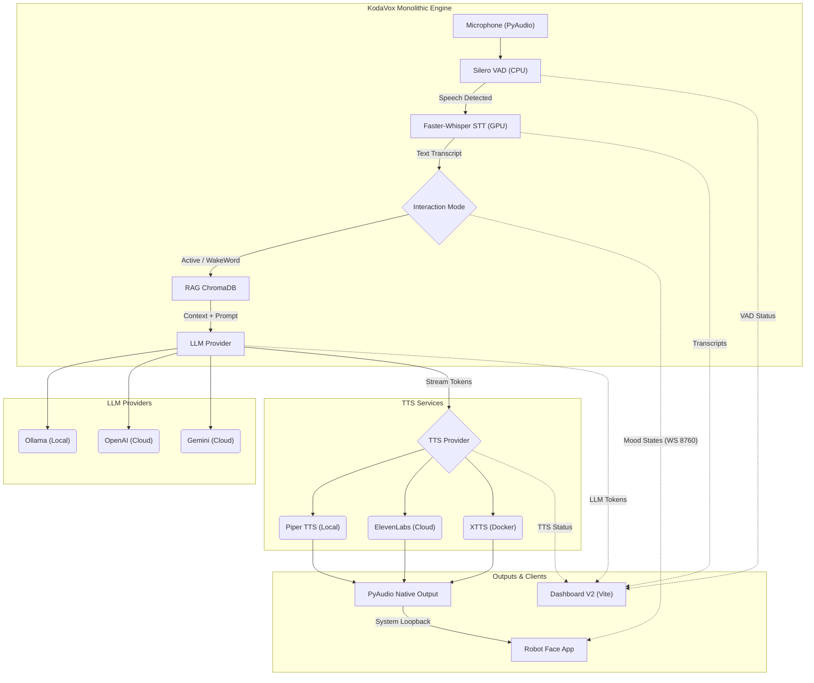

[← Volver al Índice Principal](../README.md)

# 🏗️ Arquitectura y Desarrollo

KodaVox V2 está diseñado alrededor de un **Motor Monolítico en Memoria** para reducir la latencia al mínimo absoluto. Al procesar el audio directamente en memoria y utilizar sockets bidireccionales, el sistema logra respuestas casi instantáneas (zero-internal latency) comparado con soluciones basadas en microservicios y REST APIs.

## 🚀 Nuevas Funciones y Arquitectura (V2.1)
- **Latencia Zero-Internal**: VAD y STT ahora corren en el mismo proceso de Python, eliminando saltos de red.
- **Barge-in Nativo**: El sistema detecta interrupciones de forma instantánea mediante Silero VAD local.
- **RAG y WakeWord nativos**: Se reintegraron en el core monolítico con soporte dinámico.
- **Motor Headless (Socket.IO)**: Telemetría en tiempo real y transmisión de audio crudo por WebSocket.

### Diagrama de Flujo del Sistema

### Componentes Principales

1. **VAD (Voice Activity Detection)**: Utiliza **Silero VAD** corriendo en la CPU. Evalúa ventanas de audio muy pequeñas (~32ms) para detectar con precisión cuándo el usuario empieza a hablar (Barge-in) y cuándo termina.
2. **STT (Speech-to-Text)**: Implementado con **Faster-Whisper**. En hardware compatible (NVIDIA), corre en la GPU usando cuantización `int8_float16` para máxima velocidad. **Si no cuentas con GPU**, el sistema lo detectará automáticamente y ejecutará el modelo en la CPU utilizando cuantización `int8`, lo que permite un rendimiento aceptable en procesadores modernos sin necesidad de configuración adicional.
3. **Manejador de Contexto (RAG)**: Integrado nativamente con **ChromaDB**. Antes de consultar al LLM, el texto es inyectado con contexto relevante extraído de los documentos cargados.
4. **Proveedores LLM**: Arquitectura agnóstica mediante un patrón de fábrica (`LLMFactory`). Soporta Ollama para despliegues 100% privados y locales, o OpenAI/Gemini para mayor capacidad de razonamiento.
5. **Proveedores TTS**: 
   - **Piper**: Síntesis neuronal extremadamente rápida y ligera.
   - **XTTS**: Clonación de voz avanzada alojada en Docker.
   - **ElevenLabs**: TTS en la nube de máxima expresividad mediante WebSockets.
6. **Telemetría en Tiempo Real**: Todo el estado interno (niveles de micro, detección de voz, streaming de tokens) se emite vía **Socket.IO** hacia el Dashboard V2, permitiendo un monitoreo exhaustivo sin afectar el ciclo de procesamiento de audio.

---

## 👥 Notas de Desarrollo
- El motor se comunica con **Ollama** en `http://127.0.0.1:11434`. Asegúrate de tener Ollama corriendo localmente con el modelo configurado (por defecto `qwen2.5:3b`).
- La configuración principal reside en el archivo `.env` en la raíz.
- **Descargas la Primera Vez:** Cuando cambies la variable `STT_MODEL` (ej. a `tiny` o `medium`), el sistema descargará el modelo de Internet la primera vez que se ejecute. Esto puede tomar varios minutos sin mostrar una barra de progreso; no cierres el programa.
- La voz de XTTS se conserva en la configuración persistente del servicio, para reutilizar sus latentes. Para forzar otra voz al iniciar, define `TTS_CONFIGURE_VOICE_ON_START=true` y `VOICE_SAMPLE=<archivo.wav>` en `.env`.
- Puedes seleccionar `TTS_PROVIDER=xtts`, `TTS_PROVIDER=piper` u `off`. Piper usa por defecto `models/es_MX-claude-high.onnx`, no requiere GPU ni clonación y admite ajustar la velocidad con `PIPER_LENGTH_SCALE`.
- La precisión de STT se controla con `STT_MODEL` (`small` o `medium`), `STT_INITIAL_PROMPT`, `STT_VAD_FILTER` y `STT_CONDITION_ON_PREVIOUS_TEXT`. `medium` requiere más VRAM y suele aportar mejor precisión en español.
- `INTERACTION_MODE=active` responde a cada intervención detectada por VAD. `INTERACTION_MODE=wakeword` exige que la transcripción contenga `WAKE_WORD` (por defecto `KodaVox`); puedes decir “KodaVox, ¿qué hora es?” o decir primero “KodaVox” y hacer la consulta en el siguiente turno. Tras responder, la sesión permanece abierta durante `WAKE_SESSION_TIMEOUT_SECONDS` (10 por defecto); después vuelve a requerir la frase de activación. `VAD_THRESHOLD`, `VAD_END_SILENCE_SECONDS` y `STT_MIN_SPEECH_SECONDS` controlan la sensibilidad.
